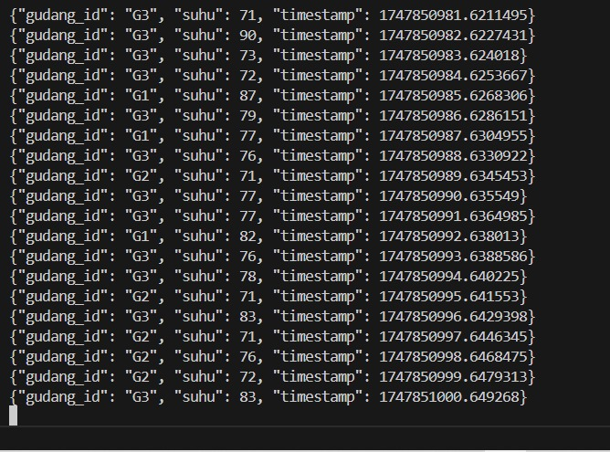

# Big Data and Data Lakehouse 
## Problem Based Learning : Apache Kafka

### Nama : Rafael Jonathan Arnoldus 
### NRP : 5027231006

# 1.Buat Topik Kafka 

#### Membuat 2 Topik Kafka
- sensor-suhu-gudang
- sensor-kelembaban-gudang  

##### Membuat Kafka dan Zookeeper dengan docker compose dan menjalankannya  
```
docker-compose up -d
``` 
##### Masuk kedalam kafka yang sudah dijalankan (Lakukan pengecekan id kafka terlebih dahulu)
```
docker ps
docker exec -it 22a6330c5df7  /bin/bash
``` 


##### Setelah masuk kita buat topicnya 
```bash
/opt/kafka/bin/kafka-topics.sh --create --zookeeper zookeeper:2181 --replication-factor 1 --partitions 1 --topic sensor-suhu-gudang

/opt/kafka/bin/kafka-topics.sh --create --zookeeper zookeeper:2181 --replication-factor 1 --partitions 1 --topic sensor-kelembaban-gudang
```

# 2.Simulasikan Data Sensor (Producer Kafka)
#### Membuat 2 Producer (Suhu dan Kelembaban)

##### Membuat sebuah program python untuk mesimulasikan pengriman suhu (sensor_suhu.py)
```py
from kafka import KafkaProducer
import json
import time
import random

# Konfigurasi Kafka
bootstrap_servers = 'localhost:9092'
topic_name = 'sensor-suhu-gudang'

# Inisialisasi Kafka Producer
producer = KafkaProducer(
    bootstrap_servers=bootstrap_servers,
    value_serializer=lambda v: json.dumps(v).encode('utf-8')
)

gudang_ids = ["G1", "G2", "G3"]

print(f"Mengirim data suhu ke topik: {topic_name}...")

try:
    while True:
        for gudang_id in gudang_ids:
            suhu = random.randint(70, 90)  # Suhu antara 70 dan 90 C

            data = {
                "gudang_id": gudang_id,
                "suhu": suhu,
                "timestamp": time.time()  # Timestamp event
            }

            producer.send(topic_name, value=data)
            print(f"Terkirim (Suhu): {data}")

        time.sleep(1)  # Kirim batch setiap 1 detik

except KeyboardInterrupt:
    print("Producer suhu dihentikan.")
finally:
    producer.flush()
    producer.close()

```
Menjalankannya : 
```bash
python sensor_suhu.py
```

Penjelasan : 
- Menggunakan kafka-python untuk mengirim data ke topik sensor-suhu-gudang.
- Membuat data dalam format JSON seperti {"gudang_id": "G1", "suhu": 82}.
- Randomisasi nilai suhu dan gudang_id untuk meniru data sensor nyata.
- Mengirim data ke Kafka setiap 1 detik menggunakan time.sleep(1).
- Meng-encode data JSON sebelum dikirimkan ke Kafka (value_serializer=json.dumps)


##### Membuat sebuah program python untuk mesimulasikan pengriman kelembaban (sensor_kelembaban.py)

```py
from kafka import KafkaProducer
import json
import time
import random

# Konfigurasi Kafka
bootstrap_servers = 'localhost:9092'
topic_name = 'sensor-kelembaban-gudang'

# Inisialisasi Kafka Producer
producer = KafkaProducer(
    bootstrap_servers=bootstrap_servers,
    value_serializer=lambda v: json.dumps(v).encode('utf-8')
)

gudang_ids = ["G1", "G2", "G3"]

print(f"Mengirim data kelembaban ke topik: {topic_name}...")

try:
    while True:
        for gudang_id in gudang_ids:
            kelembaban = random.randint(60, 85)  # Kelembaban antara 60% dan 85%

            data = {
                "gudang_id": gudang_id,
                "kelembaban": kelembaban,
                "timestamp": time.time()  # Timestamp event
            }

            producer.send(topic_name, value=data)
            print(f"Terkirim (Kelembaban): {data}")

        time.sleep(1)  # Kirim batch setiap 1 detik

except KeyboardInterrupt:
    print("Producer kelembaban dihentikan.")
finally:
    producer.flush()
    producer.close()

```
Menjalankannya : 
```bash
python sensor_kelembapan.py
```

Penjelasan: 
- Mirip dengan producer suhu, tapi mengirim ke topik sensor-kelembaban-gudang.
- Format data: {"gudang_id": "G2", "kelembaban": 75}.
- Randomisasi gudang dan nilai kelembaban (antara 60–85).
- Interval pengiriman data juga setiap detik.
- JSON encoding untuk memastikan Kafka dapat membaca nilai string dengan benar.


# 3.Konsumsi dan Olah Data dengan PySpark
#### Membuat 2 Consumer serta lakukan filtering 

##### Melihat apakah data dari producer sudah masuk 

```bash
/opt/kafka/bin/kafka-console-consumer.sh --bootstrap-server localhost:9092 --topic sensor-suhu-gudang --from-beginning

/opt/kafka/bin/kafka-console-consumer.sh --bootstrap-server localhost:9092 --topic sensor-kelembaban-gudang --from-beginning
```



##### Membuat sebuah consumer suhu (suhu.py) + filtering
```py
from pyspark.sql import SparkSession
from pyspark.sql.functions import from_json, col
from pyspark.sql.types import StructType, StringType, IntegerType

spark = SparkSession.builder \
    .appName("SuhuFilter") \
    .getOrCreate()

# Schema data suhu dari Kafka (JSON di value)
schema_suhu = StructType() \
    .add("gudang_id", StringType()) \
    .add("suhu", IntegerType())

# Baca stream Kafka topic sensor-suhu-gudang
df_suhu = spark.readStream.format("kafka") \
    .option("kafka.bootstrap.servers", "localhost:9092") \
    .option("subscribe", "sensor-suhu-gudang") \
    .option("startingOffsets", "latest") \
    .load()

# Parsing JSON dan pilih kolom penting
df_suhu_parsed = df_suhu.select(
    from_json(col("value").cast("string"), schema_suhu).alias("data")
).select("data.*")

# Filter suhu > 80
df_suhu_warning = df_suhu_parsed.filter(col("suhu") > 80)

# Format output peringatan
df_output = df_suhu_warning.selectExpr(
    "concat('[Peringatan Suhu Tinggi] Gudang ', gudang_id, ': Suhu ', suhu, '°C') as warning"
)

# Tulis ke console streaming
query = df_output.writeStream.format("console") \
    .outputMode("append") \
    .option("truncate", False) \
    .start()

query.awaitTermination()
```
Menjalankan : 
```bash
spark-submit --packages org.apache.spark:spark-sql-kafka-0-10_2.12:3.5.0 suhu.py
```

Penjelasan : 
- Konsumsi data dari Kafka topik sensor-suhu-gudang dengan format streaming.
- Parsing value dari Kafka ke JSON untuk mendapat kolom gudang_id dan suhu.
- Menambahkan kolom timestamp dan melakukan watermarking (windowing).
- Filtering: ambil data dengan suhu lebih dari 80 derajat.
- Menampilkan hasil peringatan ke console dalam format:


##### Membuat sebuah consumer kelembaban (kelembaban.py) + filtering 

```py
from pyspark.sql import SparkSession
from pyspark.sql.functions import from_json, col
from pyspark.sql.types import StructType, StringType, IntegerType

spark = SparkSession.builder \
    .appName("KelembabanFilter") \
    .getOrCreate()

# Schema data kelembaban dari Kafka (JSON di value)
schema_kelembaban = StructType() \
    .add("gudang_id", StringType()) \
    .add("kelembaban", IntegerType())

# Baca stream Kafka topic sensor-kelembaban-gudang
df_kelembaban = spark.readStream.format("kafka") \
    .option("kafka.bootstrap.servers", "localhost:9092") \
    .option("subscribe", "sensor-kelembaban-gudang") \
    .option("startingOffsets", "latest") \
    .load()

# Parsing JSON dan pilih kolom penting
df_kelembaban_parsed = df_kelembaban.select(
    from_json(col("value").cast("string"), schema_kelembaban).alias("data")
).select("data.*")

# Filter kelembaban > 70
df_kelembaban_warning = df_kelembaban_parsed.filter(col("kelembaban") > 70)

# Format output peringatan
df_output = df_kelembaban_warning.selectExpr(
    "concat('[Peringatan Kelembaban Tinggi] Gudang ', gudang_id, ': Kelembaban ', kelembaban, '%') as warning"
)

# Tulis ke console streaming
query = df_output.writeStream.format("console") \
    .outputMode("append") \
    .option("truncate", False) \
    .start()

query.awaitTermination()

```
Menjalankanya :
```bash
spark-submit --packages org.apache.spark:spark-sql-kafka-0-10_2.12:3.5.0 kelembaban.py
```
Pejelasan : 
- Konsumsi data dari sensor-kelembaban-gudang.
- Parse value JSON → kolom gudang_id dan kelembaban.
- Filter untuk kelembaban lebih dari 70%.
- Tambahkan kolom waktu untuk mendukung structured streaming.
- Format output juga langsung dicetak ke console.


# 4.Gabungkan Stream dari Dua Sensor
##### Membuat sebuah peringatan yang menggabungkan 2 sensor suhu dan kelembaban (sensor_join.py)

```py
from pyspark.sql import SparkSession
from pyspark.sql.functions import from_json, col, expr, concat_ws, lit
from pyspark.sql.types import StructType, StructField, StringType, IntegerType

spark = SparkSession.builder.appName("SensorJoinStreaming").getOrCreate()
spark.sparkContext.setLogLevel("ERROR")

# Skema data sensor suhu
schema_suhu = StructType([
    StructField("gudang_id", StringType(), True),
    StructField("suhu", IntegerType(), True)
])

# Skema data sensor kelembaban
schema_kelembaban = StructType([
    StructField("gudang_id", StringType(), True),
    StructField("kelembaban", IntegerType(), True)
])

# Membaca stream Kafka sensor suhu
df_suhu_raw = spark.readStream.format("kafka")\
    .option("kafka.bootstrap.servers", "localhost:9092")\
    .option("subscribe", "sensor-suhu-gudang")\
    .option("startingOffsets", "latest")\
    .load()

df_suhu = df_suhu_raw.select(
    from_json(col("value").cast("string"), schema_suhu).alias("data"),
    col("timestamp").alias("ts_suhu")
).select(
    col("data.gudang_id").alias("gudang_id"),
    col("data.suhu").alias("suhu"),
    col("ts_suhu")
).withWatermark("ts_suhu", "30 seconds").alias("suhu")

# Membaca stream Kafka sensor kelembaban
df_kelembaban_raw = spark.readStream.format("kafka")\
    .option("kafka.bootstrap.servers", "localhost:9092")\
    .option("subscribe", "sensor-kelembaban-gudang")\
    .option("startingOffsets", "latest")\
    .load()

df_kelembaban = df_kelembaban_raw.select(
    from_json(col("value").cast("string"), schema_kelembaban).alias("data"),
    col("timestamp").alias("ts_kelembaban")
).select(
    col("data.gudang_id").alias("gudang_id"),
    col("data.kelembaban").alias("kelembaban"),
    col("ts_kelembaban")
).withWatermark("ts_kelembaban", "30 seconds").alias("kelembaban")

# Join stream berdasarkan gudang_id dan timestamp dalam interval 10 detik
joined_df = df_suhu.join(
    df_kelembaban,
    "gudang_id"
)

# Menambahkan kolom status berdasarkan suhu dan kelembaban
status_expr = """
    CASE
        WHEN suhu.suhu > 80 AND kelembaban.kelembaban > 70 THEN 'Bahaya: suhu & kelembaban tinggi'
        WHEN suhu.suhu > 80 THEN 'Suhu tinggi, kelembaban normal'
        WHEN kelembaban.kelembaban > 70 THEN 'Kelembaban tinggi, suhu normal'
        ELSE 'Aman'
    END
"""

result_df = joined_df.withColumn("status", expr(status_expr))

# Membuat kolom laporan dengan format yang rapi
laporan_df = result_df.withColumn(
    "laporan",
    concat_ws("\n",
        concat_ws("", lit("Gudang "), col("suhu.gudang_id")),
        lit("----------"),
        concat_ws("", lit("Suhu      : "), col("suhu.suhu"), lit("°C")),
        concat_ws("", lit("Kelembaban: "), col("kelembaban.kelembaban"), lit("%")),
        concat_ws("", lit("Status    : "), col("status"))
    )
).select("laporan")

# Output stream ke console dengan interval 2 detik
query = laporan_df.writeStream \
    .outputMode("append") \
    .format("console") \
    .option("truncate", False) \
    .trigger(processingTime="10 seconds") \
    .start()

query.awaitTermination()

```
Cara menjalankannya: 
```bash
spark-submit --packages org.apache.spark:spark-sql-kafka-0-10_2.12:3.5.0 sensor_join.py
```

Penjelasan: 

- Membaca dua stream Kafka (topik suhu dan kelembaban) secara paralel.
- Melakukan parsing JSON dan assign timestamp untuk masing-masing stream.
- Menggunakan eventTimeWatermark dan join berdasarkan gudang_id dan window waktu ±10 detik.
- Setelah join, mengecek 3 kondisi:
    - Aman (suhu & kelembaban normal)
    - Hanya suhu tinggi
    - Hanya kelembaban tinggi
    - Keduanya tinggi (kondisi kritis)
- Menampilkan hasil dalam console


---
Tambahan Menjalankan dalam kasus saya: 
```bash
$env:PYSPARK_PYTHON="python"
$env:PYSPARK_DRIVER_PYTHON="python"
```

